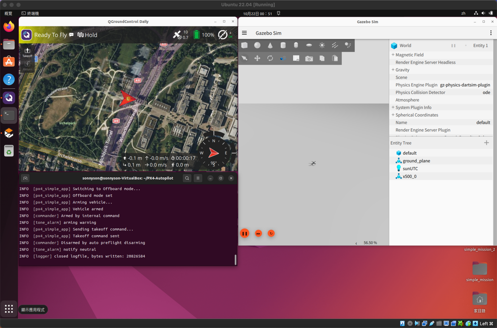

# Implementing PX4 simple automatic control module

基於Gazebo的PX4自動控制模組模擬。

## 壹、基本說明
**一、目標：**
以下為一個簡單的PX4模組範例程式碼，旨在實現指定的任務流程：起飛 → 前進1公尺 → 左右各來回1公尺 → 執行360度翻轉 → 降落。該模組可在PX4平台上運行，並透過Gazebo模擬器進行模擬測試。

**二、開發環境：**
以下是開發該平台所採用的環境：
* 虛擬機：VirtualBox
* 作業系統：Ubuntu 22.04.5
* 程式語言：C
* 程式編輯器：Visual Studio Code

## 貳、操作說明
**一、安裝步驟：**
1. PX4與Gazebo安裝步驟，可依照[Setting up a Developer Environment](https://docs.px4.io/main/en/dev_setup/dev_env_linux_ubuntu) 進行安裝。
2. QGroundControl安裝步驟，可依照[QGroundControl Installation](https://docs.px4.io/main/en/dev_setup/dev_env_linux_ubuntu) 進行安裝。

**二、檔案說明：**
1. 請從GitHub下載px4_simple_app.c檔案，並將其替換為px4_simple_app資料夾中的舊檔案。在開發過程中，我曾嘗試在modules資料夾中新增一個新的模組，但在編譯時遇到了一些困難，導致無法成功完成。因此，我希望採用這種方法來加速模組的開發流程。
```bash
.
├── PX4-Autopilot/
└── src/
     └──  examples/
           └──  px4_simple_app/
                 ├── px4_simple_app.c
                 └── CMakeLists.txt
```
2. 請在PX4-Autopilot路徑下編譯
```shell
make clean
make px4_sitl_default
```

**三、運行步驟：**
1. 開啟QGroundControl
2. 啟動SITL模擬
```shell
make px4_sitl gz_x500
```
3. 在PX4控制台中啟動程式
```shell
px4_simple_app
```
4. 模擬截圖
<p align="center">
[](https://github.com/user-attachments/assets/dc8e6b00-611d-4bcf-a0e8-75e75cf3a5d2)
</p>

## 參、反思
本專案主要在2019年款MacBook Pro上安裝VirtualBox執行PX4模擬環境。然而，由於資源限制，系統經常出現當機或效能瓶頸的情況。儘管無人機模擬可依照程式指令執行相關任務，實務上卻常遭遇模擬中斷、傳感器數值異常等問題，進而影響模擬流程與除錯效率。若本專案程式碼中仍存有疏漏，尚祈讀者不吝指正，並敬請包涵。
